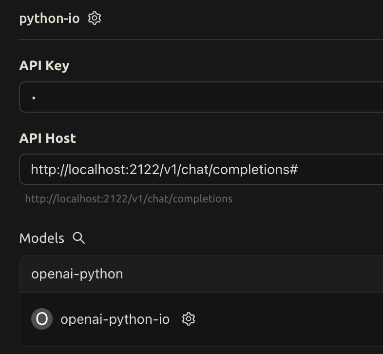

# OpenAI Python I/O

一个轻量级的模块，用于将 Python 的原生 input 和 print 函数替换为符合 OpenAI Chat Completion 规范的 SSE 流式交互功能。

## 特性

- 支持 SSE 流式输出
- 符合 OpenAI Chat Completion API 格式
- 支持中文和 UTF-8 编码
- 自动消息分页（使用 "---" 分隔符）
- 简单的消息队列管理
- 即插即用的 API 设计

## 安装

```bash
conda create -n OpenAIio python=3.12
conda activate OpenAIio

# 使用 requirements.txt 安装依赖
pip install -r requirements.txt

# 或安装到当前环境
pip install -e .
```

## 快速开始

1. 在代码中使用：

```python
from openai_python_io import sse_print, sse_input

# 输出消息
sse_print("Hello, World!")

# 获取用户输入
name = sse_input("What's your name? ")
sse_print(f"Nice to meet you, {name}!")
```

2. 前端连接：

向 `http://localhost:2122/v1/chat/completions` 发送 POST 请求，使用 SSE 连接接收响应。请求格式：

```json
{
  "stream": true,
  "messages": [{"role": "user", "content": "Hello"}]
}
```

## API 参考

### sse_print(*values, sep: str = " ", end: str = "\n")
将内容以 SSE 流式方式发送给前端。
- 当 end 为默认值 "\n" 时，添加分页符 "\n\n---\n\n"
- 当指定 end 参数时，使用指定的结尾符

### sse_input(prompt: str = "") -> str
等待并获取用户输入。会发送一个特殊的标记通知前端需要用户输入。

## 示例

查看 `openai_python_io/example.py` 了解完整的使用示例，包括：
- 基本消息输出
- 用户输入处理
- 中文和符号支持测试

### 运行示例：
```bash
python -m openai_python_io.example
```

### Cherry Studio 示例

在 [Cherry Studio](https://github.com/CherryHQ/cherry-studio) 中的使用示例：

1. 配置界面：


2. 使用示例：


## 项目结构

```
openai_python_io/
├── __init__.py    # 主要接口
├── server.py      # SSE 服务器实现
├── utils.py       # 工具类和消息队列
└── example.py     # 使用示例
```

## 许可证

MIT License